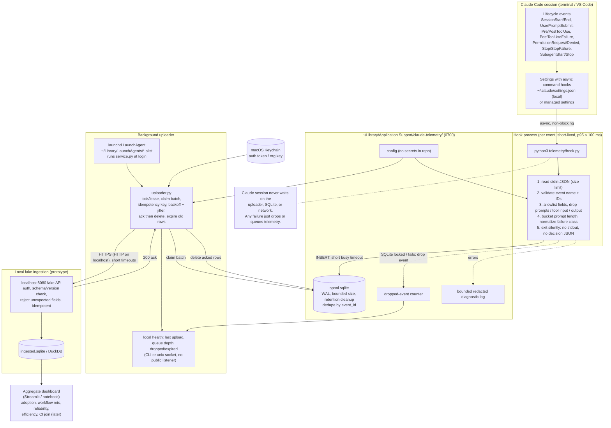
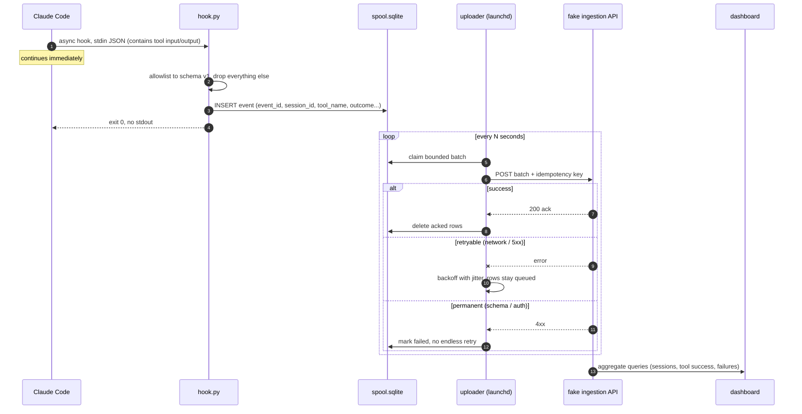

# Local Mac architecture (prototype stage)

```mermaid
flowchart TB
    subgraph CC["Claude Code session (terminal / VS Code)"]
        EV["Lifecycle events<br/>SessionStart/End, UserPromptSubmit,<br/>Pre/PostToolUse, PostToolUseFailure,<br/>PermissionRequest/Denied, Stop/StopFailure,<br/>SubagentStart/Stop"]
        SET["Settings with async command hooks<br/>~/.claude/settings.json (local)<br/>or managed settings"]
    end

    subgraph HOOK["Hook process (per event, short-lived, p95 &lt; 100 ms)"]
        H1["python3 telemetry/hook.py"]
        H2["1. read stdin JSON (size limit)<br/>2. validate event name + IDs<br/>3. allowlist fields, drop prompts / tool input / output<br/>4. bucket prompt length, normalize failure class<br/>5. exit silently: no stdout, no decision JSON"]
    end

    subgraph DATA["~/Library/Application Support/claude-telemetry/ (0700)"]
        DB[("spool.sqlite<br/>WAL, bounded size, retention cleanup<br/>dedupe by event_id")]
        DROP["dropped-event counter"]
        LOG["bounded redacted diagnostic log"]
        CFG["config (no secrets in repo)"]
    end

    subgraph SVC["Background uploader"]
        LA["launchd LaunchAgent<br/>~/Library/LaunchAgents/*.plist<br/>runs service.py at login"]
        UP["uploader.py<br/>lock/lease, claim batch,<br/>idempotency key, backoff + jitter,<br/>ack then delete, expire old rows"]
        HEALTH["local health: last upload,<br/>queue depth, dropped/expired<br/>(CLI or unix socket, no public listener)"]
    end

    KC[("macOS Keychain<br/>auth token / org key")]

    subgraph FAKE["Local fake ingestion (prototype)"]
        API["localhost:8080 fake API<br/>auth, schema/version check,<br/>reject unexpected fields, idempotent"]
        STORE[("ingested.sqlite / DuckDB")]
    end

    DASH["Aggregate dashboard<br/>(Streamlit / notebook)<br/>adoption, workflow mix, reliability,<br/>efficiency, CI join (later)"]

    EV --> SET -->|"async, non-blocking"| H1 --> H2
    H2 -->|"INSERT, short busy timeout"| DB
    H2 -. "SQLite locked / fails: drop event" .-> DROP
    H2 -. "errors" .-> LOG
    CFG --> H2
    CFG --> UP

    LA --> UP
    UP -->|"claim batch"| DB
    KC --> UP
    UP -->|"HTTPS (HTTP on localhost), short timeouts"| API
    API -->|"200 ack"| UP
    UP -->|"delete acked rows"| DB
    UP --> HEALTH
    DROP --> HEALTH
    API --> STORE --> DASH

    NOTE["Claude session never waits on the<br/>uploader, SQLite, or network.<br/>Any failure just drops or queues telemetry."]
    H1 -.- NOTE
```

## One event, end to end

```mermaid
sequenceDiagram
    autonumber
    participant C as Claude Code
    participant H as hook.py
    participant Q as spool.sqlite
    participant U as uploader (launchd)
    participant A as fake ingestion API
    participant D as dashboard

    C->>H: async hook, stdin JSON (contains tool input/output)
    Note over C: continues immediately
    H->>H: allowlist to schema v1, drop everything else
    H->>Q: INSERT event (event_id, session_id, tool_name, outcome...)
    H-->>C: exit 0, no stdout
    loop every N seconds
        U->>Q: claim bounded batch
        U->>A: POST batch + idempotency key
        alt success
            A-->>U: 200 ack
            U->>Q: delete acked rows
        else retryable (network / 5xx)
            A--xU: error
            U->>U: backoff with jitter, rows stay queued
        else permanent (schema / auth)
            A-->>U: 4xx
            U->>Q: mark failed, no endless retry
        end
    end
    A->>D: aggregate queries (sessions, tool success, failures)
```
